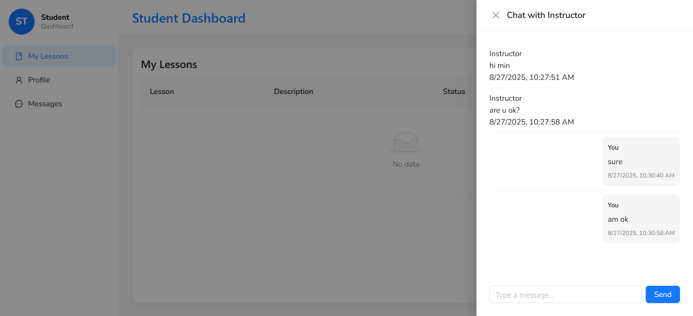

* How to run the project
open terminal
FE: npm run dev
BE: cd/backend -> npm run dev

* project structure

BE: 

src/ – The main source folder containing all application code.

routes/ – This folder contains all the API route handlers for different modules of the application:

accessCode.ts – Handles routes related to access codes.

instructor.ts – Handles routes for instructor-related operations.

message.ts – Handles routes for messaging functionality.

student.ts – Handles routes for student-related operations.

services/ – Contains services that encapsulate business logic or external API calls.

twilioService.ts – Service to interact with Twilio for SMS or messaging features.

socket/ – Contains files for real-time communication using WebSockets.

sockethandler.ts – Handles WebSocket events and connections.

types/ – Contains TypeScript type definitions to ensure type safety across the project:

message.ts – Types related to messaging.

socket.ts – Types related to WebSocket events and payloads.

firebaseAdmin.ts – Types or interfaces for Firebase Admin SDK.

index.ts – Common or shared types used across the project.

Configuration files:

.env – Environment variables for configuration (API keys, secrets, etc.).

firebase-service-account.json – Firebase service account credentials for server-side Firebase operations.

FE:
src/
This is the main source folder containing all the application code.

components/
Reusable UI components are placed here. Each component usually has its own folder containing:

Component file (e.g., Button.tsx)

Styles (e.g., Button.module.scss or Button.css)

Tests (optional)

pages/ 
Contains all page-level components or route-based layouts (depending on whether you use Next.js App Router or Pages Router). Pages represent different routes in the application.

hooks/
Custom React hooks for data fetching, state management, or utility logic.

services/
API calls and service functions. For example:

api.ts or configApi.ts for Axios instances

userService.ts for user-related API calls

constants/
Application-wide constants like API endpoints, colors, or configuration values.

utils/
Helper functions used throughout the project, such as formatting functions, validators, or data transformations.

assets/
Static assets such as images, icons, fonts, and other media files.

types/
TypeScript type definitions and interfaces used across the application.

* Screenshots of your application

NOTE: As far as I know, TWILIO does not support phone for VIETNAM area code so I cannot use numberPhone

